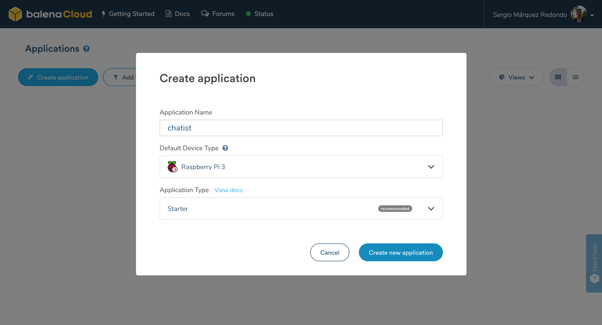
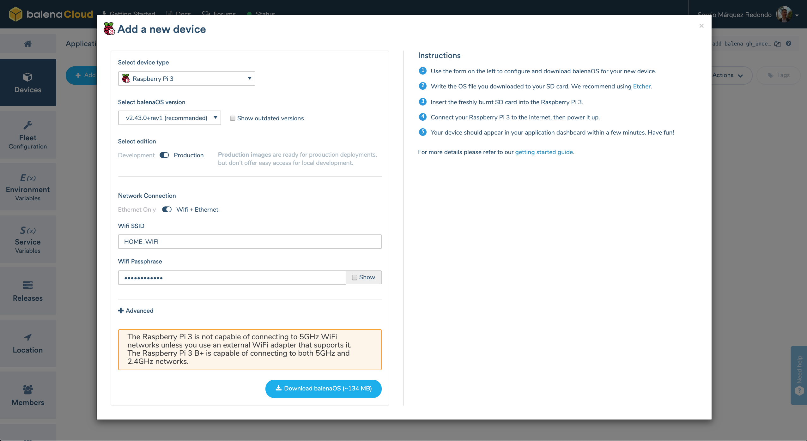
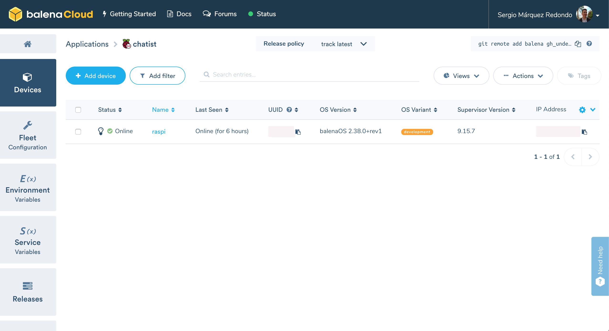
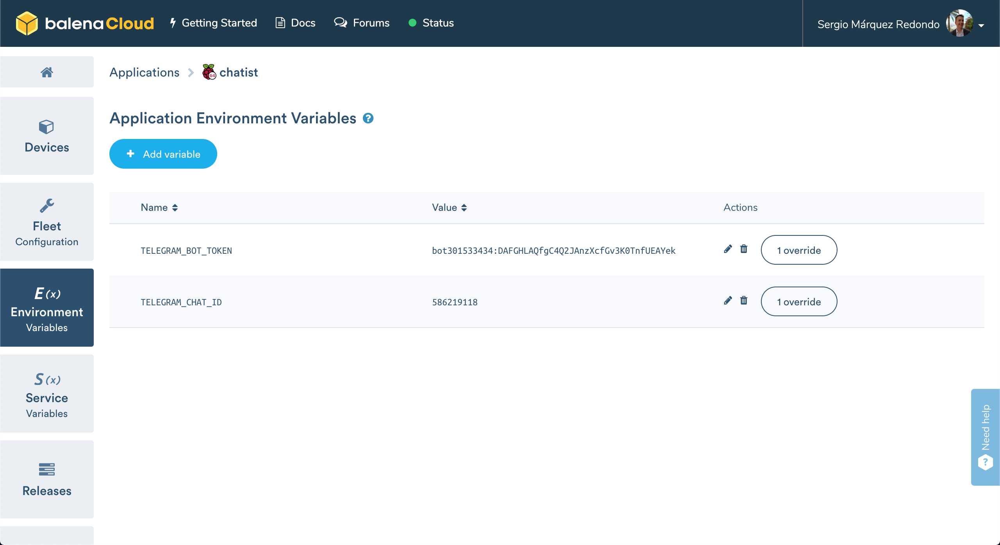
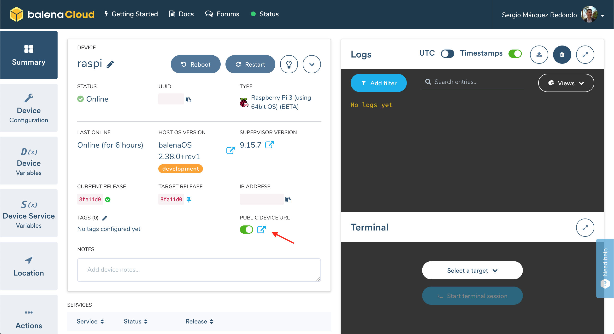
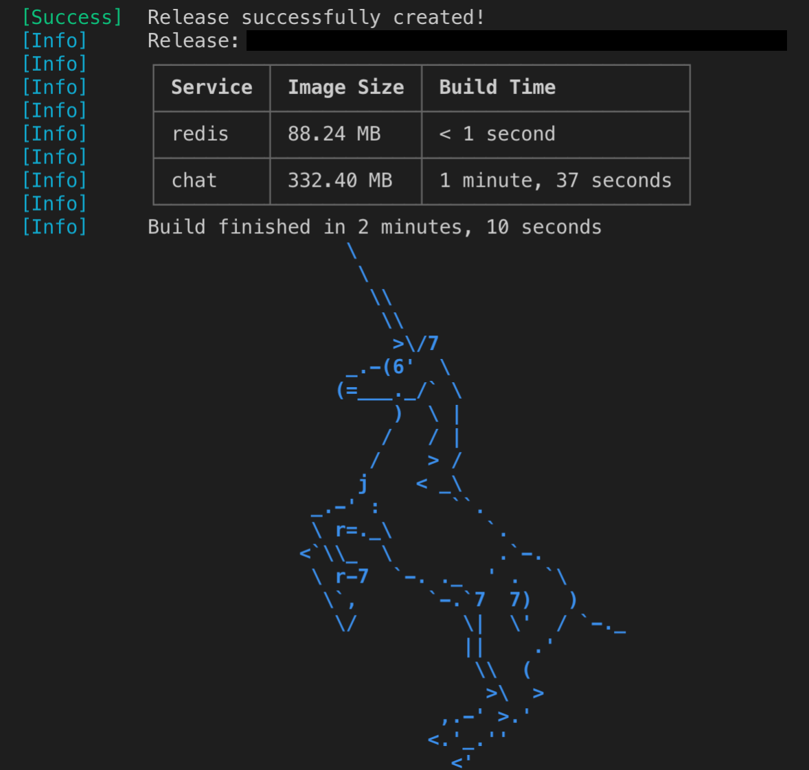
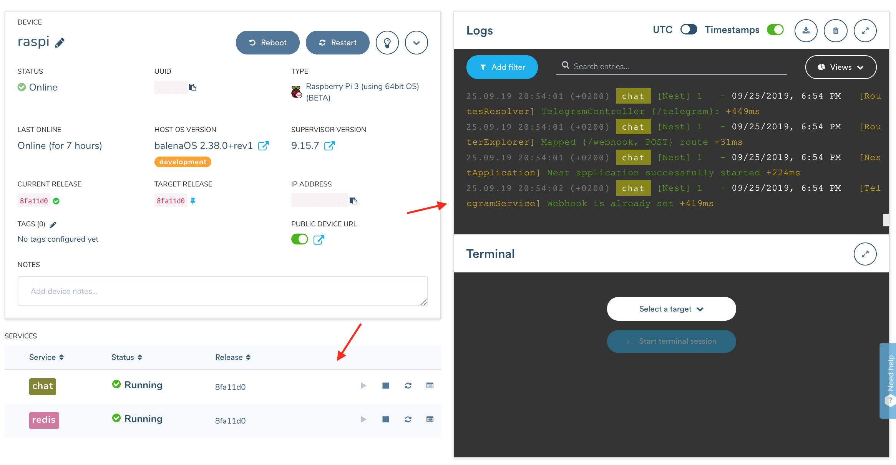

# Chatist

🐱 A chat system built with [Nest.js](https://nestjs.com/) and deployed to a Raspberry Pi through Balena.io

> Documentation is still being worked on, if you find any issue or questions you can reach me out at [sergio@mipigu.com](mailto:sergio@mipigu.com) 👋

## Demo

A working demo can be seen here: https://mipigu.com (click on "Say hello")

## Getting Started

To have a completely working project you only need to complete two steps: setup your own Telegram integration and deploy the project.

> Disclaimer: Explanation is easy to follow and altough it may seem quite some steps long, I can admit you will learn a lot in the process, because as explained here you are following the exact same steps other developers need to follow to setup their integrations, so you may expect no abstraction at all, but an unique opportunity to learn new things!

Let's start with the Telegram integration by creating our own bot and bootstrap the chat room we'll use later on to connect to Chatist.

### Create and setup your bot

1. Login or create Telegram account, and open Telegram app

2. Follow this link to add BotFather: https://telegram.me/BotFather

3. Inside the BotFather conversation, click start

4. We'll now create a new bot, write /newbot

5. Write your bot name, this could be whatever you like, for example ChatBot

6. Write your bot username, this name needs to be available and must end in "bot"

7. Your bot has been created, BotFather will return you a token, it is very important as we'll need it later on to setup the chatbox.

### Create the chat room

1. Start a conversation with your newly created bot, you can search for it via the username in the global search, or just follow this link t.me/your_bot_username, where you need to replace "your_bot_username" with your actual bot username.

2. Click start, and write /setup

3. From your browser, visit this link: https://api.telegram.org/bot<YOUR_BOT_TOKEN>/getUpdates, you must replace <YOUR_BOT_TOKEN> with your actual bot token from Step 1, an example of how the link should be is lik the following: https://api.telegram.org/bot925151832:AEEFGlaRhlvj2adppRvchbFps4sdQ0NeA_t/getUpdates

4. You will receive a response like the following, find your chat id and write it down for later use.

```js
{
  "ok":true,
  "result": [
    {
      "update_id": 920130777,
      "message": {
        "message_id": 2,
        "from": {
          "id": 523419118,
          "is_bot": false,
          "first_name": "Sergio",
          "last_name": "M\u00e1rquez",
          "username": "undervane",
          "language_code": "en"
          },
        "chat": {
          "id": 523419118, // <-- We are interested in this number
          "first_name": "Sergio",
          "last_name": "M\u00e1rquez",
          "username": "undervane",
          "type": "private"
          },
        "date": 1568202859,
        "text": "f"
      }
    }
  ]
}
```

We have now finished with the Telegram setup and we can start setting up the integration with Chatist. Keep your bot token and chat id near you because we'll use them shortly.

### Setup your project for deployment

1. Clone the project to your computer

```bash
git clone https://github.com/undervane/chatist.git
```

2. Get inside the project directory

```bash
cd chatist
```

Now it's time to choose an option for deployment, although this project is completely generic in terms of deployment, I really recommend you to follow the deployment through Balena, it's free for up to 10 devices and will save you lots of manual configuration. You even get a nice dashboard from where you'll be able to control your application status and easely change between releases if anything goes wrong.

However one of the most interesting reasons is you actually get a publicly available device url with SSL enabled from where you'll be able to access to your Chatist distribution.

You should consider that if you choose the manual deployment you'll need to provide your own SSL certificate because Telegram integration needs a secured endpoint to setup a webhook.

We'll get started then with the Balena deployment.

### Deployment with Balena (Device Configuration)

0. Before starting make sure you have an account in Balena, if not create one here: https://dashboard.balena-cloud.com/signup

1. Login to your Balena account and add a new application. You can set the name you want and select your device (this project works on all Balena supported devices).



2. Now add a new device to your newly created application, you can leave default options although you need some kind of customization, then click download.



3. Once finished downloading, get your SD card, we'll use Etcher to burn the image on it. You can download Etcher here: https://www.balena.io/etcher/

> In case you get stucked in any part of the new device setup process, you can refer to the official Balena docs here: https://www.balena.io/docs/learn/getting-started/raspberrypi3/nodejs/#add-your-first-device

4. Once finished with Etcher, disconnect from power your Raspberry Pi (in case you have it connected) and insert the SD card to it. Then you can power it up.

> Keep in mind if you chose the ethernet-only option, you may connect to the internet before powering it up.

5. Your device should appear in your application dashboard as soon as it starts up (starting from a few seconds to a few minutes depending on the speed of your SD card).



6. While we wait for previous step, we can setup the application environment variables, so recover your bot token and chat id from previous step because we'll need it now.

You need to add two environment variables: `TELEGRAM_BOT_TOKEN` and `TELEGRAM_CHAT_ID`

> Copy as is, it's case sensitive.



7. When device is already in the application dashboard, get into it and activate the public device url. Copy the url, we'll need to add another environment variable.



8. Go back to the application environment variables and add a new variable called `TELEGRAM_BOT_WEBHOOK` with the previous copied device url as the value, but adding `/telegram/webhook` to the end. 

The final variable should have as value something like the following:

`https://a0s1b10f5efdbg245befhafaa5f3846ef.balena-devices.com/telegram/webhook`

9. Go back to your device dashboard, we have finished with the Balena configuration and we are now able to deploy our own Chatist distribution through the Balena CLI.

### Deployment with Balena (CLI)

0. Download, install (if you have not done it yet) and follow the configuration steps for the official Balena CLI application from here: https://github.com/balena-io/balena-cli/blob/master/INSTALL.md

1. Once installed and running, make sure you are loged in to your Balena account.

```bash
balena login
```

2. Now we are finally ready to deploy our Chatist distribution! From the console, navigate to the cloned Chatist project base directory (as we left in step 2 in "Setup your project for deployment")

3. Now deploy the distribution to your application and configured devices. Make sure to replace `your-application-name` with your actual application name.

```bash
balena push your-application-name
```

If everything goes fine, you should see something like below:



4. Now go back to your device dashboard and see the magic happening in realtime.

Congratulations! 🎉

You now have your own Chatist distribution completely deployed.



You can use Firecamp (from here: https://firecamp.app/) to simulte a client for your Chatist distribution.

> Documentation to simulate with Firecamp and manual deployment is currently in progress
